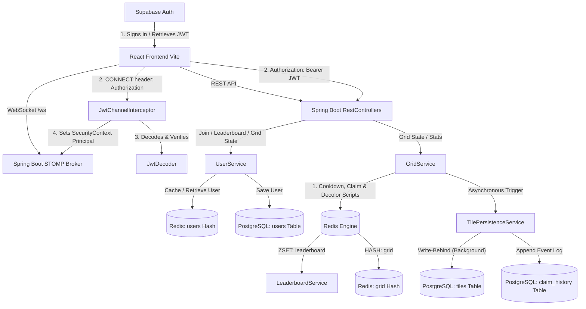

# ⚔️ GridWar: Real-Time Shared Grid Claiming Game

GridWar is a high-throughput, multiplayer, real-time shared grid claiming game. Players authenticate using **Supabase JWT**, join the game, and battle over a dynamic **90×100 grid** by claiming empty tiles or decoloring their own tiles. 

The application utilizes a **high-performance dual-database architecture** (Redis as a real-time hot cache, PostgreSQL as a durable database) with asynchronous write-behind persistence to guarantee sub-millisecond response times at scale.

---

## 🗺️ System Architecture

The following diagram illustrates the flow of real-time WebSocket communication, REST endpoints, authentication synchronization, and backend database persistence.



---

## 🚀 Core Architectural Design Principles

1. **Memory-First, Persistence-Later (Write-Behind)**
   All critical gameplay events (tile claims, decolors, and score tracking) happen instantly in-memory within Redis. Background threads asynchronously replicate these state changes to PostgreSQL. This decouples database write latency from the client render loop.
2. **Atomic Operations via Redis Lua Scripts**
   To prevent concurrency races (e.g., two users claiming the same empty tile simultaneously), all critical grid state checks and updates are executed as single atomic transactions inside Redis using Lua scripts.
3. **Optimistic UI with Active Rollback**
   The frontend renders claims instantly before receiving WebSocket confirmation. If the server rejects the request (due to cooldowns or concurrent claims), the client rolls back the state and flashes an error on the canvas.

---

## ☕ Spring Boot Backend Architecture (`/demo`)

The Spring Boot backend is built using **Java 21**, **Spring Boot 4.0.6**, **Spring Data Redis (Lettuce)**, **Spring Data JPA**, and **Spring Security**.

### 1. Real-Time WebSockets & STOMP Protocol

The application leverages **STOMP (Simple Text Oriented Messaging Protocol)** over WebSockets via SockJS for real-time bi-directional messaging.

*   **Config (`WebSocketConfig`)**:
    *   Enables an in-memory message broker with destinations prefixes:
        *   `/topic` (Public broadcasts)
        *   `/queue` (Private, user-targeted unicasts)
    *   Applications map client-inbound destinations starting with `/app`.
    *   Registers `/ws` as the endpoint for SockJS connections.
    *   Appends `JwtChannelInterceptor` to the inbound channel registration.

*   **Authentication Interception (`JwtChannelInterceptor`)**:
    *   Intercepts WebSocket `CONNECT` frames.
    *   Extracts the token from the native `Authorization` header (`Bearer <token>`).
    *   Decodes it via the Spring Security `JwtDecoder` and sets the resulting `UsernamePasswordAuthenticationToken` as the principal user on the STOMP session headers.
    *   Subsequent frames (`SUBSCRIBE`, `SEND`) carry this principal, allowing handlers to determine the caller's identity securely.

*   **Error Routing**:
    *   Errors are routed only to the caller's private queue by targeting `/user/queue/error` (which resolves internally to `/user/{sessionId}/queue/error`), ensuring that failures are not leaked to other users.

---

### 2. Supabase JWT Integration & Security Config

JWT verification relies on a hybrid Spring Security setup that seamlessly decodes tokens generated by Supabase (HS256 algorithm).

*   **Dual-Verification Decoder (`JwtConfig`)**:
    *   **Verified HS256 Path**: The decoder attempts signature verification using the Base64-decoded Supabase project JWT secret (`supabase.jwt.secret`).
    *   **Unverified Decoding Fallback**: If the secret is missing, incorrect, or verification fails, the decoder falls back to decoding the token without verification. It reconstructs a valid Spring Security `Jwt` object using claims mapped via `com.auth0:java-jwt`. This prevents development-stage lockouts while maintaining standard user identification properties.
*   **Role Mapping**:
    *   A custom `JwtAuthenticationConverter` reads the Supabase `app_metadata` claims structure and maps user roles directly into Spring Security granted authorities (e.g., `ROLE_authenticated`).

---

### 3. Redis Engine & Atomic Lua Scripts

Redis functions as a high-performance in-memory transaction engine and cache. 

#### Data Structures:
*   **Grid Hash (`"grid"`)**: A hash map where fields are `row_col` strings (e.g. `23_89`) and values are serialized JSON representing the tile state:
    ```json
    {
      "userId": "uuid-string",
      "username": "PlayerName",
      "color": "#HEXCLR",
      "claimedAt": "ISO-8601-Timestamp"
    }
    ```
*   **User Hash (`"users"`)**: A hash map where keys are `userId` strings and values are user configurations (ID, username, color).
*   **Leaderboard ZSET (`"leaderboard"`)**: A sorted set mapping `userId` values to their current scores (total number of claimed tiles).
*   **Cooldown Key (`"cooldown:{userId}"`)**: Temporary string key with a 5-second TTL.
*   **Presence Key (`"online:{userId}"`)**: String key with a 30-second TTL representing an active connection.

#### Lua Scripts:
The scripts are registered as `@Bean`s of type `DefaultRedisScript<Long>` inside `RedisConfig`:

1.  **Claim Tile Script (`claimTileScript`)**:
    *   Checks if the tile field exists in the `"grid"` hash.
    *   If it **does not exist**, sets the field to the provided JSON payload and returns `1`.
    *   If it **does exist**, returns `0` (rejection).
    
    ```lua
    local existing = redis.call('HGET', KEYS[1], KEYS[2])
    if existing then return 0 end
    redis.call('HSET', KEYS[1], KEYS[2], ARGV[1])
    return 1
    ```

2.  **Decolor Tile Script (`decolorTileScript`)**:
    *   Fetches the JSON value of the target tile from `"grid"`.
    *   Decodes the JSON using `cjson.decode` and verifies if the stored `userId` matches the requester's `userId`.
    *   If matched, deletes the field from the hash and returns `1`. Otherwise, returns `0`.
    
    ```lua
    local existing = redis.call('HGET', KEYS[1], KEYS[2])
    if not existing then return 0 end
    local ok, data = pcall(cjson.decode, existing)
    if not ok then return 0 end
    if data['userId'] ~= ARGV[1] then return 0 end
    redis.call('HDEL', KEYS[1], KEYS[2])
    return 1
    ```

3.  **Cooldown Lock Script (`cooldownScript`)**:
    *   Checks if the key `cooldown:{userId}` exists.
    *   If it **does exist**, returns the remaining milliseconds using `PTTL`.
    *   If it **does not exist**, sets the key to `'1'` with an expiration of `ARGV[1]` (5 seconds) and returns `0` (lock acquired).
    
    ```lua
    local exists = redis.call('EXISTS', KEYS[1])
    if exists == 1 then
      return redis.call('PTTL', KEYS[1])
    end
    redis.call('SET', KEYS[1], '1', 'EX', ARGV[1])
    return 0
    ```

---

### 4. Out-of-Band PostgreSQL Persistence (Write-Behind)

All write operations to PostgreSQL are decoupled from the WebSocket thread pool. When a claim or decolor action completes in Redis, `GridService` delegates database synchronization to `TilePersistenceService`.

*   **Asynchronous Processing**:
    *   Persistence methods are annotated with `@Async` and run on a dedicated background thread execution pool.
    *   `@Transactional` ensures database operations (tile upserts, transaction history, user score modifications) commit cleanly.
*   **Database Schema**:
    *   **`users` Table**: Matches the `User` entity, storing `id` (UUID), `username`, `color`, and `tiles_owned` counters.
    *   **`tiles` Table**: Maps `tile_id` (Primary Key, coordinate format e.g. `23_89`), `owner_id` (Foreign Key referencing `users.id`), and `claimed_at` timestamp.
    *   **`claim_history` Table**: A continuous event stream documenting every claim action: `id` (Auto-increment), `tile_id`, `user_id`, and `claimed_at`.
*   **SQL Optimizations**:
    *   Uses Hibernate reference proxies (`userRepository.getReferenceById()`) to create foreign key relationships without running select queries against the `users` table.
    *   Increments and decrements the user's `tiles_owned` counter using custom database-level queries (`UPDATE User u SET u.tilesOwned = u.tilesOwned + 1...`) to prevent dirty read/write concurrency race conditions.

---

### 5. Redis Warm-Up on Startup

Since Redis holds the active state of the game, a server restart would wipe out the active grid and leaderboard. To prevent this data loss, `GridInitializer` (an `ApplicationRunner`) runs during Spring Boot startup.

1.  **State Check**: Inspects the length of the Redis `"grid"` hash using `HLEN`.
2.  **Grid Recovery**: If the grid hash is empty, it queries all claimed tiles from PostgreSQL using a optimized JPQL query (`JOIN FETCH` to prevent N+1 queries for user data) and writes them into the Redis `"grid"` hash.
3.  **Leaderboard Rebuild**: Aggregates total tile claims per user directly in the database (`COUNT(t) GROUP BY t.owner.id`) and uses these scores to reconstruct the Redis `"leaderboard"` sorted set (`ZADD`).

---

## 🎨 React Frontend Architecture (`/dnew`)

The frontend is a lightweight SPA built with **React**, **Vite**, **SockJS-client**, and **HTML5 Canvas**.

### 1. HTML5 Canvas Graphics Loop & Interactive Viewport

Instead of rendering thousands of DOM elements (which would bottleneck standard browsers), the grid uses a single high-performance `<canvas>` element (1699×1529 pixels).

*   **Double-Buffering & rAF Batching**:
    *   Updates received via WebSockets are batched inside a `pendingDraws` ref.
    *   An animation frame is scheduled via `requestAnimationFrame` to flush all updates simultaneously. This minimizes layout thrashing.
*   **Optimistic Rendition**:
    *   When the user clicks a valid tile, the grid immediately colors it locally and starts a **3-second rollback timer**.
    *   If the server confirms the change over WebSocket, the timer is cleared. If no confirmation arrives within 3 seconds, the optimistic change is reverted to its original color.
*   **Visual Flair & Micro-Animations**:
    *   **Expanding Glow Rings**: When a tile is claimed, a recursive animation loop draws expanding, fading outline rings centered on the tile.
    *   **Error Flash**: If a claim is rejected (e.g. target tile occupied), the tile flashes light red for `400ms` before reverting.
    *   **Hover Glow**: Moving the cursor over the grid highlights the targeted tile with a bright orange border (`#f97316`).

### 2. Viewport Navigation & Mini Map

*   **Pinch & Drag Viewport**:
    *   Calculates viewport scale (`0.5x` to `4.0x`) and coordinate translations based on wheel zoom and mouse drag vectors.
    *   Updates the canvas container's CSS transform dynamically to keep pan operations buttery smooth.
*   **Dynamic Mini Map (50×50)**:
    *   Maintains a separate tiny `<canvas>` in the viewport corner.
    *   Draws a scaled-down snapshot of all tiles in the grid.
    *   Uses the client's current container size and viewport offset coordinates to overlay an orange boundary box showing exactly where the user is looking.

### 3. Session Integration & Handshake

*   **Automatic Handshake**: On load, the client checks for existing Supabase Auth sessions.
*   **Server Sync**: If a valid token is found, it sends a REST `POST` request to the backend `/api/users/join` to register or synchronize the user data, storing the profile details (username, generated HSL color) in the client's `localStorage` and React state.

---

## 🔌 API & STOMP Protocol Specification

### HTTP Endpoints

| Endpoint | Method | Authentication | Payload / Request Parameters | Response Payload | Description |
| :--- | :--- | :--- | :--- | :--- | :--- |
| `/api/users/join` | `POST` | Optional Bearer JWT | `{ "username": "Alice" }` | `{ "userId": "uuid", "username": "Alice", "color": "#HCLR" }` | Registers/syncs user profile. Generates a distinct HSL color using golden-ratio spacing. |
| `/api/grid` | `GET` | None | None | `{ "tiles": { "row_col": { "userId", "username", "color", "claimedAt" } } }` | Retrieves the full active grid state. Call once on initialization. |
| `/api/leaderboard` | `GET` | None | None | `{ "rankings": [ { "rank", "userId", "username", "color", "score" } ] }` | Retrieves the top 10 rankings. |
| `/api/online-count` | `GET` | None | None | `{ "count": 42 }` | Retrieves the number of active users. |

### STOMP Destinations

| Destination | Type | Session Headers | Payload | Description |
| :--- | :--- | :--- | :--- | :--- |
| `/app/claim` | `SEND` (Inbound) | `Authorization: Bearer <token>` | `{ "tileId": "23_89", "userId": "uuid" }` | Requests to claim/decolor a tile. |
| `/app/heartbeat` | `SEND` (Inbound) | None | `{ "userId": "uuid" }` | Kept-alive ping sent every 15s to refresh user's online TTL in Redis. |
| `/topic/grid` | `SUBSCRIBE` (Outbound) | None | `{ "tileId": "23_89", "userId": "uuid"/"null", "username", "color", "claimedAt" }` | Broadcasts grid updates (claimed/decolored tiles) to all players. |
| `/topic/leaderboard` | `SUBSCRIBE` (Outbound) | None | `{ "rankings": [ { "rank", "userId", "username", "color", "score" } ] }` | Broadcasts updated rankings to all players. |
| `/user/queue/error` | `SUBSCRIBE` (Outbound) | None | `{ "type": "OCCUPIED"/"INVALID", "message": "error msg", "tileId" }` | Informs a specific user session about a validation or logic failure. |

---

## 🛠️ Getting Started & Setup

### Requirements
*   **Java 21 JDK**
*   **Node.js** (v18+) & **npm**
*   **PostgreSQL Database**
*   **Redis Database**

### 1. Backend Configuration
Create or edit `demo/demo/src/main/resources/application.properties`:

```properties
server.port=9000

# PostgreSQL Data Source
spring.datasource.url=jdbc:postgresql://localhost:5432/demo
spring.datasource.username=your_db_user
spring.datasource.password=your_db_password
spring.datasource.driver-class-name=org.postgresql.Driver

# JPA Configuration
spring.jpa.hibernate.ddl-auto=update
spring.jpa.properties.hibernate.dialect=org.hibernate.dialect.PostgreSQLDialect

# Redis Configuration
spring.data.redis.host=your_redis_host
spring.data.redis.port=6379
spring.data.redis.password=your_redis_password

# Supabase JWT Secret Configuration (for signature verification)
supabase.jwt.secret=your_supabase_jwt_secret
```

### 2. Running the Backend
From the `demo/demo` directory, execute:
```bash
./mvnw clean spring-boot:run
```

### 3. Frontend Configuration
Ensure `dnew/.env.development` points to your backend instance:
```env
VITE_API_URL=http://localhost:9000
VITE_SUPABASE_URL=https://your-supabase-project.supabase.co
VITE_SUPABASE_ANON_KEY=your-anon-key
```

### 4. Running the Frontend
From the `dnew` directory, install dependencies and start the Vite development server:
```bash
npm install
npm run dev
```
The client dashboard will launch at `http://localhost:5173`.
